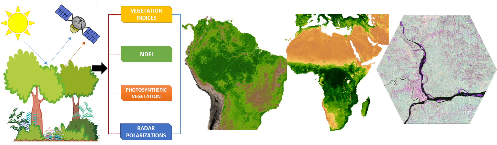

[](https://opensource.org/licenses/MIT)
[](https://paypal.me/APROGIS?locale.x=es_XC)
[](https://badge.fury.io/py/forestools)

# forestools

**forestools** is a Python package that was created to provide tools for monitoring and mapping vegetation cover, especially detecting deforestation. The [**PVts-Beta**](https://www.sciencedirect.com/science/article/abs/pii/S1470160X18305326) approach, a non-seasonal detection approach (time-series-based), is implemented in this package. 



# IEEE Geoscience and Remote Sensing Letters

This repository is part of the paper "Mapping deforestation using fractions indices and the PVts-beta approach" submitted to [IEEE Geoscience and Remote Sensing Letters](https://ieeexplore.ieee.org/xpl/mostRecentIssue.jsp?punumber=8859).

# Funding

The development of this package was funded by [American Program in GIS and Remote Sensing (APROGIS)](https://www.apgis-rs.com/).  ARROGIS was established in 2018 as a leading scientific institution and pioneer in the field of Remote Sensing and Geographic Information Systems (GIS). APROGIS promotes the use of state-of-the-art space technology and earth observation for the sustainable development of states. It is an institution capable of generating new knowledge through publications in the highest impact journals in the field of Remote Sensing. More about APROGIS [here](https://www.apgis-rs.com/acerca-de-nosotros/mision-y-vision).

# Introduction

**forestools** is a Python package mainly focused on mapping and monitoring deforestation, although it can be used for monitoring forest degradation or detecting early warnings. The detection algorithm embedded in this package is a non-seasonal detection approach - unlike seasonal algorithms - that does not model the seasonal component of a time series, is intuitive, has only one calibration parameter, and can be run with vegetation indices such as NDVI and EVI, photosynthetic vegetation from CLASlite software, with radar polarizations, and with NDFI fraction indices. In fact, this package includes an algorithm that is capable of obtaining NDFI indices, which until now was only possible to obtain from Google Earth Engine.

**forestools** is intended for students, professionals, researchers, and organizations dedicated to forest monitoring and assessment, and any public interested in mapping the changes experienced by the different forests on the planet due to anthropogenic disturbances but also to minor natural disturbances.

# Installation

To used **forestools** it is necessary to install first. There are three options:

## 1. From PyPI

**forestools** is available on [PyPI](https://pypi.org/project/forestools/), so to install it, run this command in your terminal:

    pip install forestools

## 2. Installing from source

It is also possible to install the latest development version directly from the GitHub repository with:
    
    pip install git+git://github.com/ytarazona/forestools.git

# Examples

## 1. Obtaining NDFI index

Landsat 8 OLI (Operational Land Imager) was used to obtain the NDFI index in this example. This image contain bands: B2, B3, B4, B5, B6, B7.

```python
from forestools import ndfiSMA
import rasterio
import matplotlib.pyplot as plt
import matplotlib as mpl

# Read raster bands
imgRas = rasterio.open('tests/data/LC08_232066_20190727.jp2')
    
# Raster to Numpay arrays
image = imgRas.read()
    
# Obtaining NDFI from Surface Reflectance
ndfi = ndfiSMA(x = image, procesLevel = 'SR')

# Let's define the color palette
palette = mpl.colors.ListedColormap([
            "#FFFFFF","#FFFCFF","#FFF9FF","#FFF7FF","#FFF4FF","#FFF2FF","#FFEFFF","#FFECFF","#FFEAFF","#FFE7FF",
            "#FFE5FF","#FFE2FF","#FFE0FF","#FFDDFF","#FFDAFF","#FFD8FF","#FFD5FF","#FFD3FF","#FFD0FF","#FFCEFF",
            "#FFCBFF","#FFC8FF","#FFC6FF","#FFC3FF","#FFC1FF","#FFBEFF","#FFBCFF","#FFB9FF","#FFB6FF","#FFB4FF",
            "#FFB1FF","#FFAFFF","#FFACFF","#FFAAFF","#FFA7FF","#FFA4FF","#FFA2FF","#FF9FFF","#FF9DFF","#FF9AFF",
            "#FF97FF","#FF95FF","#FF92FF","#FF90FF","#FF8DFF","#FF8BFF","#FF88FF","#FF85FF","#FF83FF","#FF80FF",
            "#FF7EFF","#FF7BFF","#FF79FF","#FF76FF","#FF73FF","#FF71FF","#FF6EFF","#FF6CFF","#FF69FF","#FF67FF",
            "#FF64FF","#FF61FF","#FF5FFF","#FF5CFF","#FF5AFF","#FF57FF","#FF55FF","#FF52FF","#FF4FFF","#FF4DFF",
            "#FF4AFF","#FF48FF","#FF45FF","#FF42FF","#FF40FF","#FF3DFF","#FF3BFF","#FF38FF","#FF36FF","#FF33FF",
            "#FF30FF","#FF2EFF","#FF2BFF","#FF29FF","#FF26FF","#FF24FF","#FF21FF","#FF1EFF","#FF1CFF","#FF19FF",
            "#FF17FF","#FF14FF","#FF12FF","#FF0FFF","#FF0CFF","#FF0AFF","#FF07FF","#FF05FF","#FF02FF","#FF00FF",
            "#FF00FF","#FF0AF4","#FF15E9","#FF1FDF","#FF2AD4","#FF35C9","#FF3FBF","#FF4AB4","#FF55AA","#FF5F9F",
            "#FF6A94","#FF748A","#FF7F7F","#FF8A74","#FF946A","#FF9F5F","#FFAA55","#FFB44A","#FFBF3F","#FFC935",
            "#FFD42A","#FFDF1F","#FFE915","#FFF40A","#FFFF00","#FFFF00","#FFFB00","#FFF700","#FFF300","#FFF000",
            "#FFEC00","#FFE800","#FFE400","#FFE100","#FFDD00","#FFD900","#FFD500","#FFD200","#FFCE00","#FFCA00",
            "#FFC600","#FFC300","#FFBF00","#FFBB00","#FFB700","#FFB400","#FFB000","#FFAC00","#FFA800","#FFA500",
            "#FFA500","#F7A400","#F0A300","#E8A200","#E1A200","#D9A100","#D2A000","#CA9F00","#C39F00","#BB9E00",
            "#B49D00","#AC9C00","#A59C00","#9D9B00","#969A00","#8E9900","#879900","#7F9800","#789700","#709700",
            "#699600","#619500","#5A9400","#529400","#4B9300","#439200","#349100","#2D9000","#258F00","#1E8E00",
            "#168E00","#0F8D00","#078C00","#008C00","#008C00","#008700","#008300","#007F00","#007A00","#007600",
            "#007200","#006E00","#006900","#006500","#006100","#005C00","#005800","#005400","#005000","#004C00"])
            
# Displaying the index
plt.figure(figsize=(12,12))
plt.imshow(ndfi, cmap = palette)
plt.title('NDFI - Landsat 8 OLI')
```
The output:


## 2. Breakpoint in an NDFI series

Here an NDFI series between 2000 and 2019 from -1 to 1.

```python
import numpy as np
import matplotlib.pyplot as plt

# NDFI series
serie = np.array([0.84, 0.93, 0.89, 0.75, 0.87, 0.89, 0.845, 0.8425, 0.70, 0.89, 0.95,
0.90, 0.94, 0.95, 0.89, 0.805, 0.8025, 0.80, 0.20, -0.40])
              
# Index between 2000 - 2019
time = np.arange('2000', '2020', dtype = 'datetime64[Y]')

# Displaying the series
fig, axes = plt.subplots(figsize = (20,12))
axes.plot(time, serie, marker = '.', ms = 7, linewidth = 0.7, color = 'gray', 
          label ='NDFI series')
axes.set_xlabel('Time')
axes.set_ylabel('NDFI Value')
axes.legend(loc = "lower left", fontsize = 20)
```
The output:


### 2.1 Applying a smoothing

Before detecting a breakpoint, it is necessary to apply a smoothing to remove outliers. So, we'll use the **smootH** function from the **forestools** package. This function accepts 1d array and 2d array, so that if we are working with time series we will need to convert to array -> **serie.to_numpy()**. 

```python
from forestools import smootH
import numpy as np
import matplotlib.pyplot as plt

# Apply a smoothing
ndfi_smooth = smootH(x = serie)
time = np.arange('2000', '2020', dtype='datetime64[Y]')

# Displaying the series
# Series without smoothing
fig, axes = plt.subplots(figsize = (20,12))
axes.plot(time, serie, marker='.', ms = 7, linewidth = 0.7, color = 'silver', 
          label='NDFI series')
# Series with smoothing
axes.plot(time, ndfi_smooth, marker='.', ms = 7, linewidth = 1, color = 'blue', 
          label='NDFI series - smoothed')
axes.set_xlabel('Time')
axes.set_ylabel('NDFI Value')
axes.legend(loc="lower left", fontsize = 20)
```
The output:


### 2.2 Detecting a change

Let's detect change in 2018. For this, we will used the **pvts** function. First, *numpy.ndarray* will be used to detect change, and then we will do the same using *pandas.core.series.Series*.

**_<div class="alert alert-warning"><font color='darkblue'> Although detecting changes using *numpy.ndarray* is recommended and avoid indexing confusion.</font></div>_**

#### 2.2.1 Using *numpy.ndarray* 

Let's use the output of the *smootH* function (**ndfi_smooth**), but we'll need to convert to 1d array with *ravel()*.

Parameters:
- **x**: smoothed series preferably to optimize detections.
- **startm**: monitoring year, index 18 (i.e., year 2018)
- **endm**: year of final monitoring, index 18 (i.e., also year 2018)
- **threshold**: detection threshold (for NDFI series we will use 5). If you are using PV series, NDVI or EVI series you can use 5, 3 or 3 respectively. Please see [Tarazona et al. (2018)](https://www.sciencedirect.com/science/article/abs/pii/S1470160X18305326) for more details.

> **Note**: You can change the detection threshold if you need to. 

```python
from forestools import pvts

# Let's detect change
cd = pvts(x = ndfi_smooth.ravel(), startm = 18, endm = 18, threshold = 5)

# The output
cd
{'Ts': array([ 0.84, 0.93, 0.89, 0.88, 0.885, 0.89, 0.845, 0.8425, 0.86625, 0.89, 0.95, 
0.945, 0.94, 0.95, 0.89, 0.805, 0.8025, 0.80, 0.20, -0.40]),
 'Monitoring_period': {'start': 18, 'end': 18},
 'Breakpoint': {'Year_index': 18, 'value': 0.2},
 'Threshold': {'Threshold': 5, 'Lower_limit': 0.6540094878459528}}
```

Then, we can visualize the breakpoint in an graphic using the *plot* function.

```python
from forestools import plot
from pylab import rcParams
rcParams['figure.figsize'] = 15, 7

# Let´s plot the graphic
plot(cd, title = 'Non-seasonal detection approach', xlabel = 'Index', ylabel = 'NDFI')
```
The output:


#### Example of Breakpoint not detected

```python
# Let's detect change
cd = pvts(x = ndfi_smooth.ravel(), startm = 17, endm = 17, threshold = 5) # No change in 2017

# The output is a dictionary
cd
{'Ts': array([0.84, 0.93, 0.89, 0.88, 0.885, 0.89, 0.845, 0.8425, 0.86625, 0.89, 0.95, 0.945, 0.94, 0.95, 0.89, 0.805, 0.8025,0.8, 0.2, -0.4]),
 'Monitoring_period': {'start': 17, 'end': 17},
 'Breakpoint': {'Year_index': nan, 'value': nan},
 'Threshold': {'Threshold': 5, 'Lower_limit': 0.6769803673192302}}
```

#### 2.2.2 Using *pandas.core.series.Series* 

Let's use again the output of the smootH function (**ndfi_smooth**), but we'll need to convert to time series.

Parameters:
- **x**: smoothed series preferably to optimize detections.
- **startm**: monitoring year, '2018-12-31' (i.e., year 2018).
- **endm**: year of final monitoring '2018-12-31' (i.e., also year 2018).
- **threshold**: for NDFI series we will use $5$.

> **IMPORTANTE NOTE**: Whenever we use *pandas.core.series.Series* to detect change, we must put both *start* and *end* on the last day of the last month of the year. For example, if our monitoring year is 2010, then **`start = '2010-12-31'`** and **`end = '2010-12-31'`**. If our monitoring period is from 2000 to 2010, then **`start = '2000-12-31'`** and **`end = '2010-12-31'`**.

```python
from forestools import pvts
import pandas as pd

# Serie between 2000 - 2019
index = pd.date_range('2000', '2020', freq ='A')
ndfi_serie = pd.Series(ndfi_smooth.ravel(), index = index)

# Let's detect change
cd = pvts(x = ndfi_serie, startm = '2018-12-31', endm = '2018-12-31', threshold = 5)

# The output
cd
{'Ts': 2000-12-31    0.84000
 2001-12-31    0.93000
 2002-12-31    0.89000
 2003-12-31    0.88000
 2004-12-31    0.88500
 2005-12-31    0.89000
 2006-12-31    0.84500
 2007-12-31    0.84250
 2008-12-31    0.86625
 2009-12-31    0.89000
 2010-12-31    0.95000
 2011-12-31    0.94500
 2012-12-31    0.94000
 2013-12-31    0.95000
 2014-12-31    0.89000
 2015-12-31    0.80500
 2016-12-31    0.80250
 2017-12-31    0.80000
 2018-12-31    0.20000
 2019-12-31   -0.40000
 Freq: A-DEC, dtype: float64,
 'Monitoring_period': {'start': '2018-12-31', 'end': '2018-12-31'},
 'Breakpoint': {'Year_index': '2018-12-31', 'value': 0.2},
 'Threshold': {'Threshold': 5, 'Lower_limit': 0.6540094878459526}}
```

Then, we can visualize the breakpoint in an graphic using the *plot* function.

```python
from forestools import plot
from pylab import rcParams
rcParams['figure.figsize'] = 15, 7

# Let´s plot the graphic
plot(cd, title = 'Non-seasonal detection approach', xlabel = 'Index', ylabel = 'NDFI')
```
The output:


